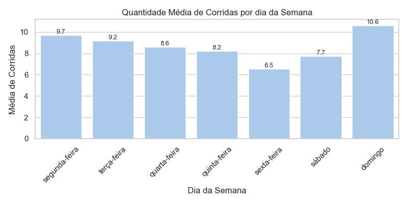
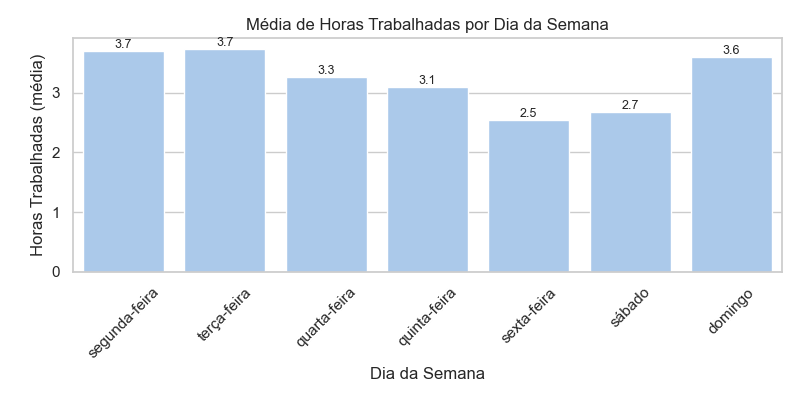
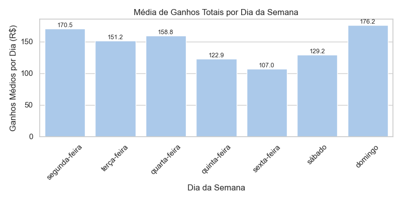
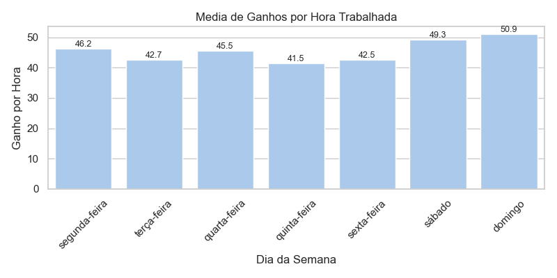

# 🚘 Motorista Data Insights

Análise exploratória de dados de corridas de motoristas de aplicativo para entender padrões de ganhos, horários ideais e regiões mais lucrativas.

## 🎯 Objetivos
Ajudar motoristas a aumentar seus ganhos entendendo:

* Melhores horários para trabalhar  
* Dias da semana mais lucrativos por hora trabalhada  
* Viagens mais lucrativas  
* Tempo ocioso e como evitá-los

## 🗂️ Estrutura
- `data/`: dados originais (não versionados)  
- `notebooks/`: análises exploratórias  
- `src/`: scripts reaproveitáveis  
- `outputs/`: gráficos e relatórios finais  

## 📊 Gráficos e Insights

Os gráficos desenvolvidos têm como objetivo gerar inteligência prática para motoristas, permitindo decisões mais estratégicas com base em dados reais:

1. **📅 Corridas por Dia da Semana:**  
   Mostra a média de corridas realizadas em cada dia da semana. Isso ajuda o motorista a identificar quais dias têm maior demanda.  
   

2. **⏱️ Horas Trabalhadas por Dia:**  
   Mede o tempo total de trabalho por dia. Permite entender em quais dias o motorista tende a trabalhar mais e ajustar sua rotina para otimizar esforço versus retorno.  
   

3. **💰 Ganhos Totais por Dia:**  
   Compara a média de ganhos totais por dia. É fundamental para perceber quais dias são mais lucrativos em termos absolutos.  
   

4. **🕒 Ganhos por Hora Trabalhada:**  
   Este é o principal indicador de eficiência. Mostra em quais dias o motorista ganha mais por hora, revelando os períodos com melhor custo-benefício de trabalho.  
   
